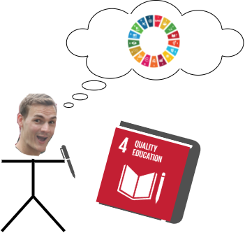
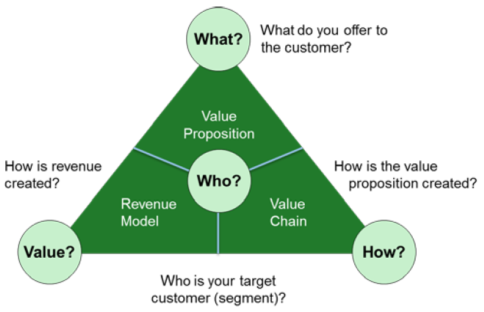

# MAIDICO Learning Journal

The aim of this journal is to account for the learning progress in the subject of managing digital companies. 

The following topics will be covered in every section:
- lessions learned
- personal achievements & critical relflection
- research topics/sources

## Table of Contents  
- [SDGs and New Business Development Case](#sdgs-and-new-business-development-case) 
- [International Business Activities](#international-business-activities)
- [Finance](#finance) 
- [Sustainability Management](#sustainability-management) 
- [International- and People Management](#international--and-people-management)  
- [Development Tools](#development-tools)  
- [IT Governance](#it-governance)  

## SDGs and New Business Development Case

#### Lessions Learned
A business model is a holistic picture of the economic activities of a company.The following four dimensions can be used as a model:

To remain economically competitive, the business model must be regularly updated. While research and development departments aim to improve a company's technologies and products, the development of new business models is often neglected. 

In the future, competition will also include business models, hence it is important to improve in this area.
Companies usually establish a common understanding of how they operate and how they maximize their profits. Therefore, certain patterns prevail that are not often challenged. These patterns prevent innovation and lead to an inability to adapt to change. This state of affairs can be disastrous for companies and lead to their ruin.

Introducing innovations is a difficult task, as is developing a new business model. As there are many factors to consider, this task is best tackled by a group of experts.

Steps to create an innovation workshop:

- Challenge the prevailing business logic: 
Apply appropriate [business models](https://businessmodelnavigator.com/explore) to the company. Make sure to not only pick the obvious ones and iterate the process
- Create a culture of openness
- Carefully decide when to change between divergent and convergent thinking.

#### Reflection

With my technical background, I tend to attribute success to good technologies and products. I have always wondered why a company like McDonalds, which in my opinion does not sell the best burgers, can be so successful. Apparently their key to success are some well coordinated business models.

- No Frills: McDonals products are simple and the same nationwide
- Franchising: Individual entrepreneurs can open branches
- Target the poor: They keep prices as low as possible
- Self Service: They save on staff through the availability of ordering stations
- User Designed: Competitions to design individual burgers ensure customer loyalty

The unique and innovative combination of these business models ensures McDonalds' economic success.

The lession for myself is to extend my scope not only to develop good technical solutions, but also to integrate them into a well-defined and thought-out strategy.

#### Used Materials
- [The St. Gallen Business
Model Navigator](https://elearning.hslu.ch/ilias/ilias.php?baseClass=ilrepositorygui&cmd=sendfile&ref_id=5994376)  
- [Business Models McDonalds](https://businessmodelnavigator.com/case-firm?id=63)

## International Business Activities
To induce international business activites there is a necessity for a strategy for the following topics.

##### Product Managment
Think about an adequate product mix.

- What are our core products?
- Which additional products should we sell?
- (How) should we adapt the products to the local market?
- What after-sale services should we offer? (i.e. derlivery, installation...)

Brand and made in
standardize/adapt product?

##### Pricing Strategy
Reflect about the best pricing strategy to use:

| **Method** 	    | **Strategy**          | **Description**           |
|-----------	    |-----	                |-----	                    |
| Cost based  	    | Standardized pricing 	| Same price everywhere     | 
|           	    | Geocentric pricing  	| Price for geographic area |
| Competitor based 	| Market penetration    | As low as possible        |
|           	    | Market skimming       | Set deliberately high     |
| Demand based 	    | Adaption pricing      | Based on local factors    |

##### International Promotion
A good reputation is necessary for business success.
Therefore it is important to select decent promoting and selling channels.
It depends on:
- What's the audience?
- What's the values of the communities/culture?

Advertisement has to be legal, suitable and cost-conscious. Consider wheter to standardize or adopt advertisement to the respecitve audiences & culturess.

##### Distribution and Logistics 
A well organized distribution and logistics are a core compontent for business success. Consider wheter to choose B2C or B2B distribution.

| **Method** 	    | **Advantages**                    | **Disadvantages**                     |
|-----------	    |-----	                            |-----	                                |
| B2C  	            | Direct access to the customer   	| High economical risks                 | 
|           	    | Short channel (high profits)      | Intensive market research required    |
|           	    |                                   |                                       |
| B2B          	    | High quantities                   | Lower profits                         |
|           	    | Market knowledge & network        | More distance to the customer         |
|           	    | Shared economical risk            |                                       |
|           	    | Additional services               |                                       |

For B2B there are the following types of intermediaries:

- Distributors: B2B Relationship with Manufacturers
- Wholesalers: Buy large quantities direct from distributors
- Retailers: Sell directly to the customer

Intermediaries have to be chosen carefully based on the following criteria:

- Skills, expertise, experience & reputation
- Sales potential
- Coverage of the target market (intensive, selective, exclusive)
- Commitment for the partnership
- Financial stability

##### Service Product Characteristics
Physical goods are tangible. It is nessecarry to offer the customer more than just a physical product at a low price. Modern economics are more about services which share the following properties:

- Intangible (less comparable)
- Perishability (can't be stored)
- Heterogenity (difficult to standardize)
- Inseperability (simultanious consumption and production)

The elements to provide good services are:
- well trained people
- sophisticated process
- try to create physical evidence

#### Lessions Learned

#### Reflection

#### Used Materials
[International Business Case Study](https://elearning.hslu.ch/ilias/ilias.php?baseClass=ilrepositorygui&cmd=sendfile&ref_id=6021619)

## Finance

## Sustainability Management

## International- and People Management

## Development Tools

## IT Governance

