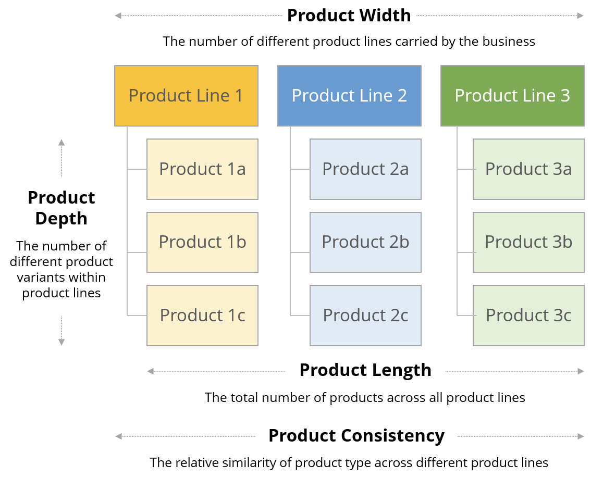

# MAIDICO Learning Journal

The aim of this journal is to account for the learning progress in the subject of managing digital companies. 

The following topics will be covered in every section:
- lessions learned
- personal achievements & critical relflection
- research topics/sources

## Table of Contents  
- [SDGs and New Business Development Case](#sdgs-and-new-business-development-case) 
- [International Business Activities](#international-business-activities)
- [Finance](#finance) 
- [Sustainability Management](#sustainability-management) 
- [International- and People Management](#international--and-people-management)  
- [Development Tools](#development-tools)  
- [IT Governance](#it-governance)  

## SDGs and New Business Development Case

#### Lessions Learned
A business model is a holistic picture of the economic activities of a company.The following four dimensions can be used as a model:

To remain economically competitive, the business model must be regularly updated. While research and development departments aim to improve a company's technologies and products, the development of new business models is often neglected. 

In the future, competition will also include business models, hence it is important to adequately improve in this area too.
Companies usually establish a common understanding of how they operate and how they maximize their profits. Therefore, certain patterns prevail that are often not challenged. These patterns prevent innovation and lead to an inability to adapt to change. This state of affairs can be disastrous for companies and lead to their ruin.

Introducing innovations is a difficult task, as is developing a new business model. As there are many factors to consider, this task is best tackled by a group of interdisciplinary experts.

Steps to create an innovation workshop:

- Challenge the prevailing business logic: 
Apply appropriate [business models](https://businessmodelnavigator.com/explore) to the company. Make sure to not only pick the obvious ones and iterate the process
- Create a culture of openness
- Carefully decide when to change between divergent and convergent thinking.

#### Reflection

With my technical background, I tend to attribute success to good technologies and products. I have always wondered why a company like McDonalds, which in my opinion does not sell the best burgers, can be so successful. Apparently their key to success are some well coordinated business models:

- No Frills: McDonals products are simple and the same nationwide
- Franchising: Individual entrepreneurs can open branches
- Target the poor: They keep prices as low as possible
- Self Service: They save on staff through the availability of ordering stations
- User Designed: Competitions to design individual burgers ensure customer loyalty

The unique and innovative combination of these business models ensures McDonalds' economic success.

The lesson for me is not to limit my scope of action to developing good technical solutions, but also to integrate them into a well-defined and thought-out strategy. Such a strategy can be developed through a systematic thinking approach:

- Identify the stakeholders and their needs
- Get them to work together in a profitable way
- Apply an appropriate revenue model

#### Used Materials
- [The St. Gallen Business
Model Navigator](https://elearning.hslu.ch/ilias/ilias.php?baseClass=ilrepositorygui&cmd=sendfile&ref_id=5994376)  
- [Business Models McDonalds](https://businessmodelnavigator.com/case-firm?id=63)

## International Business Activities

#### Lessions Learned
In order to initiate international business activities, a strategy is required for the following topics:

__1. Product Managment__

Think about an appropriate product mix.  

- What are the core products?
- What additional products and services should be sold?
- Should the products be adapted to the local market? How should they be introduced?
- Can we maintain our product brand?

__2. Pricing Strategy__

Think about the best pricing strategy to address the target market.

| **Method** 	    | **Strategy**          | **Description**           |
|-----------	    |-----	                |-----	                    |
| Cost based  	    | Standardized pricing 	| Same price everywhere     | 
|           	    | Geocentric pricing  	| Price for geographic area |
| Competitor based 	| Market penetration    | As low as possible        |
|           	    | Market skimming       | Set deliberately high     |
| Demand based 	    | Adaption pricing      | Based on local factors    |

__3. International Promotion__

A good reputation is essential for business success.
Therefore, it is important to choose appropriate advertising and distribution channels. 

Important questions for appropriate advertising:
- What is the target group?
- What are popular advertising channels?
- What are the values of the communities/culture?

Advertising must be legal, appropriate and cost-conscious. Consider whether you want to standardise advertising or adapt it to the respective target groups and cultures.

__4. Distribution and Logistics__

Well-organised distribution and logistics are central to business success. Consider whether you choose B2C or B2B business relationships.

| **Method** 	    | **Advantages**                                | **Disadvantages**                     |
|-----------	    |-----	                                        |-----	                                |
| B2C  	            | Direct access to the customer   	            | High economic risk                    | 
|           	    | Short distribution channels (high profits)    | Intensive market research required    |
| B2B          	    | High volumes/quantities                       | Lower profits                         |
|           	    | Market knowledge & network                    | Greater distance to the customer      |
|           	    | Shared economic risk                          |                                       |
|           	    | Additional services                           |                                       |

In B2B, there are the following types of intermediaries:

- Distributors: B2B relationship with manufacturers
- Wholesalers: Buy large quantities directly from distributors
- Retailers: Sell directly to the customer

Intermediaries must be carefully selected according to the following criteria:

- Skills, expertise, experience and reputation
- Sales potential
- Coverage of the target market (intensive, selective, exclusive)
- Commitment to the partnership
- Financial stability

__5. Service Product Characteristics__
It is necessary to offer the customer more than just a physical product at a low price. In the modern economy, it is more about services that have the following characteristics:

- Intangible (less comparable)
- Perishable (cannot be stored)
- Heterogeneity (difficult to standardise)
- Irretrievability (simultaneous consumption and production).

The elements for providing good services are:

- Well trained staff
- Sophisticated procedures
- Attempt to create physical evidence

#### Reflection
On a high level, international business activities have many similarities with domestic business activities. Services and goods have to be produced, advertised, distributed and sold to customers. The way the customer experiences the providing process influences the image of the company/brand. Therefore, it is important to create an experience in the delivery to retain existing customers and attract new ones. To achieve this goal, it is necessary to know the market and find ways to optimise the customer experience at a given cost.

On closer inspection, there are many differences and difficulties in detail. One of the biggest questions is whether to standardise or adapt, and if so, to what extent.

Products can be adapted to different markets. If the development process takes place mainly at the headquarters in the country of residence, some cultural needs are probably not taken into account.  
Example: Mali may not be the best market for a western company selling high quality induction cookers and pans.

1. Traditional cooking practices in Mali rely heavily on open fire cooking 
2. There are frequent power outages, making electric-powered cooking a poor option
3. The country has a very low GDP per capita and therefore cannot afford high prices

For these reasons, standardisation could not be achieved. An option would be to launch a new product line with low cost, open fire compatible cooking pans.

In marketing, it is crucial to find the right way to approach customers. Cultural differences such as individualism or collectivism must be taken into account in advertising. Nevertheless, it is important not to individualise advertising too much, as this could lead to perceptual difficulties when customers travel to different countries where the same products are sold.  

Pricing is more of a strategic matter. The choice of an appropriate pricing strategy depends equally on the target market, competition, financial resources and the company's long-term goals in that market. If demand for a product is very high and competition is low, prices can be set as follows.

1. be set deliberately low to achieve large volumes
2. deliberately set high to achieve high profits.

The strategies could have the following long-term consequences:

1. the company would most likely become the market leader. The risk would be that the market would become oversaturated and profits would fall.
2. the high profits would most likely attract other competitors. Therefore, profits should be reinvested to maintain a good market position.

I have learned that success in international business depends on gaining the right insights and choosing a strategy that best fits these conditions. The most difficult thing is to gain the right insights because we tend to think in learned patterns. These patterns change when you engage with other cultures, and there is a great danger that you simply forget a crucial aspect for business success. The best way to counter this risk is to reach out to local people and build international relationships.

## Finance

### Lessions Learned
Financial management involves planning, organizing, controlling, and monitoring financial resources to achieve organizational goals efficiently. Its primary objectives are to maximize wealth, ensure liquidity, manage risks, and make effective financial decisions. Key activities in financial management include:

1. __Financial Planning__: Developing budgets, forecasts, and strategies to align financial resources with business goals.
2. __Capital Structure Management__: Determining the right mix of debt and equity to fund operations while minimizing costs and maximizing returns.
3. __Investment Decisions__: Evaluating potential opportunities to invest in projects or assets that yield the highest returns.
4. __Risk Management__: Identifying, assessing, and mitigating financial risks to protect the organization's assets and financial health.
5. __Working Capital Management__: Monitoring and managing short-term assets and liabilities to ensure smooth operational efficiency.

Financial management is crucial for any organization, as it ensures the efficient use of resources, minimizes financial risks, and ultimately contributes to the achievement of long-term business objectives.

There are Key Performance Indicators (KPIs) to transparently compare sales, costs, margins, profit and investments.

To avoid distorting the KPIs between different departments, services and goods should be offered at transfer prices. These should be chosen strategically:

- Market-based: to increase the profit margin of production
- Cost-based: to increase turnover
- Negotiated: to optimise turnover and profit margin
- Managed: to keep them under tight control

### Reflection
Financial management is crucial for the success and sustainability of any business. Its importance goes beyond accounting, it's a strategic approach that impacts every aspect of an organization. By effectively managing finances, a company can make informed decisions, allocate resources wisely, and mitigate risks. It is about focussing the company on its goals and finding its way in a complex economic environment.

The following paragraph is a good example of what financial management can achieve at government level:

As this [paper](https://www.oecd.org/sti/inno/33719708.pdf) shows, OECD member countries have largely increased funding for research and development (R&D). Higher levels of R&D funding are seen as contributing to an innovation process that improves economic performance, increases productivity and leads to higher wages and living standards. But the realisation of R&D goals goes beyond financial objectives and requires social and economic restructuring. This includes shifts in the industrial structure towards high-technology sectors, improvements in public research policy and a stronger focus on skilled labour.

#### Used Materials
- [What is Financial Management](https://www.youtube.com/watch?v=WNm_ez1h7Tc)
- [Kapitalrendite](https://www.alpha-star-aktienfonds.de/blog/aktienbewertung/kapitalrendite/)
- [TARGETING R&D: ECONOMIC AND POLICY IMPLICATIONS OF INCREASING R&D SPENDING (Sheehan & Wyckoff)](https://www.oecd.org/sti/inno/33719708.pdf)

## Sustainability Management

#### Lessions Learned
The attitude of companies has a major influence on climate protection measures. Sustainability is often part of the risk management department or even outsourced. Although climate marketing is now widespread, climate action has not increased significantly. This phenomenon is called the "Big Disconnect".

Three different corporate attitudes can be identified in relation to sustainability:

__0.0:__ One-dimensional concern &rarr; Financial only, the company tends to improve returns to shareholders through externalisation.  
__1.0:__ Three-dimensional concern &rarr; Including social and economic factors, often due to external pressure.  
__2.0:__ Tripple bottom line &rarr; Financial, environmental and social factors are managed and reported _equally_. Such companies aim to create social, environmental and financial value.  
__3.0:__ Outside in &rarr; Every sustainability problem is a business opportunity. Such companies make money by solving environmental and social problems.

The production of services and goods generates external effects such as waste or greenhouse gases. Today, these externalities are not taken into account in a transparent way when developing pricing models. For a more sustainable future, it is important to create a circular economy in which resources and products remain in circulation as long as possible, reducing waste streams and minimising the need for new raw materials. In such an economy, growth and material extraction can finally be decoupled. A circular economy consists of several circular ecosystems.
A circular ecosystem coordinates different business models that complement each other to create sustainable value propositions with closed resource loops based on coordinated product design.

The environmental, social and financial implications of a circular economy are very promising. Many environmental problems could be solved and revenues increased due to the huge potential for resource savings.

This picture illustrates that any adjustment in one of the dimensions of the business model has a direct impact on at least two dimensions of sustainability. Therefore, adjustments need to be carefully considered and take into account the entire product life cycle as well as the impact on the entire ecosystem, like business partners or suppliers.

The 38 patterns of circular economy delivers a toolbox to gain such a holistic image of the business environment.

The patterns are divided into four categories:

- Closing the loop: Focuses on maximising the recovery of a product and minimising the need for new raw materials.
- Improving the cycle: Focuses on improvements in the use phase of a product and reducing undesirable, negative impacts
- Monetising the cycle: focuses on revenue and appropriate consumption
- Stimulating the cycle: Focuses on awareness raising and customer engagement 

The goal of a sustainable economy is to incorporate material science and business perspectives to create innovation in collaboration with businesses partners.  

The circular canvas visualises the business activities involved to promote a circular product life cycle.

#### Reflection
It's evident that achieving a sustainable economy requires a significant shift in corporate mindset and practices. The need to move beyond mere marketing strategies towards tangible actions and integrated sustainability across all aspects of a business model is crucial. The emphasis on the circular economy, with its focus on reducing waste and promoting responsible consumption, is a promising approach.

The interconnected nature of business activities and their impact on the environment and society underscores the complexity and importance of a holistic approach. Companies need to consider the broader ecosystem, engage with stakeholders, and innovate in collaboration to create sustainable solutions.

The toolbox of 38 patterns of the circular economy provides a practical framework for companies to adapt their strategies, encouraging a shift towards a more sustainable future. By focusing on aspects such as closing the loop, improving cycles, monetizing responsible consumption, and stimulating awareness, businesses can take concrete steps towards a circular economy.

#### Used Materials
- Business Model Innovation for the Circular Economy (Takacs et al.)

## International- and People Management

## Development Tools

## IT Governance

